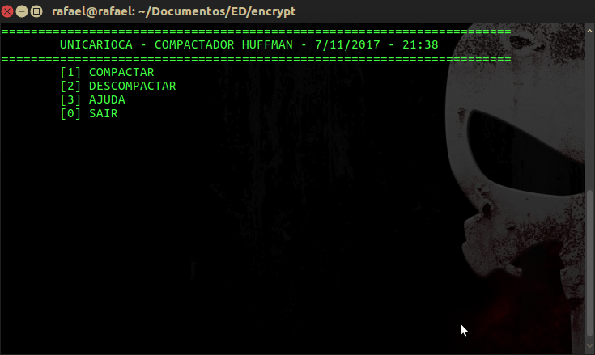
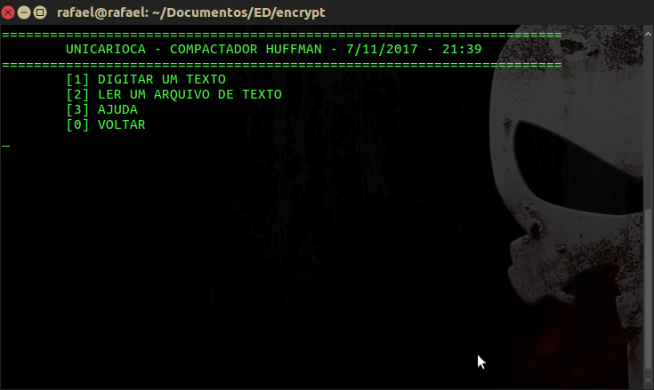
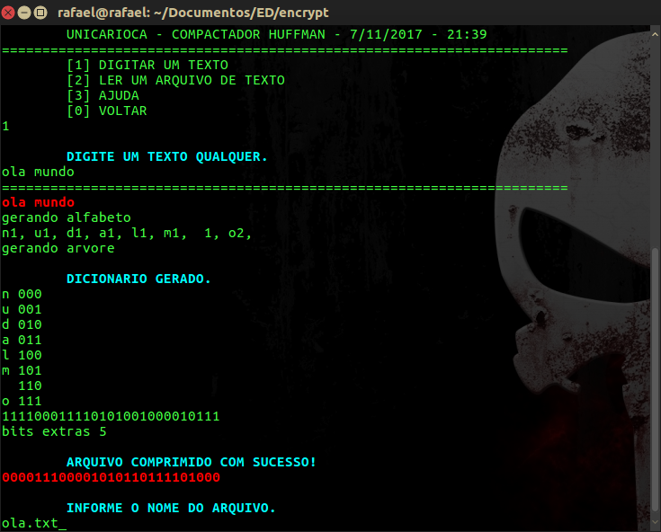
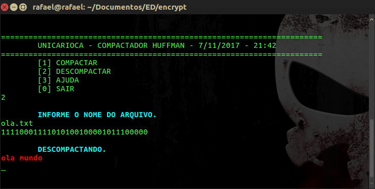

# encrypt  :floppy_disk:

### encriptador e compressor de strings.  :closed_lock_with_key:

## Apresentação   :eyes:
:camera:

- [x] Compactar
- [x] Descompactar
- [ ] Ajuda

### Compactar
:camera:

- [x] Le entrada do teclado
- [x] Le arquivo de texto
- [ ] Ajuda

:camera:

* imprime texto lido :book:
* imprime alfabeto gerado :abcd:
* imprime dicionario gerado :books:
* imprime sequencia de bits gerado :mag_right:
* imprime bits exedentes :1234:

### Descompactar
:camera:

* imprime sequencia de bits lido :mag_right:
* imprime texto gerado :book: